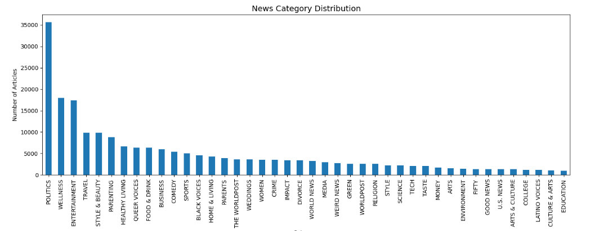
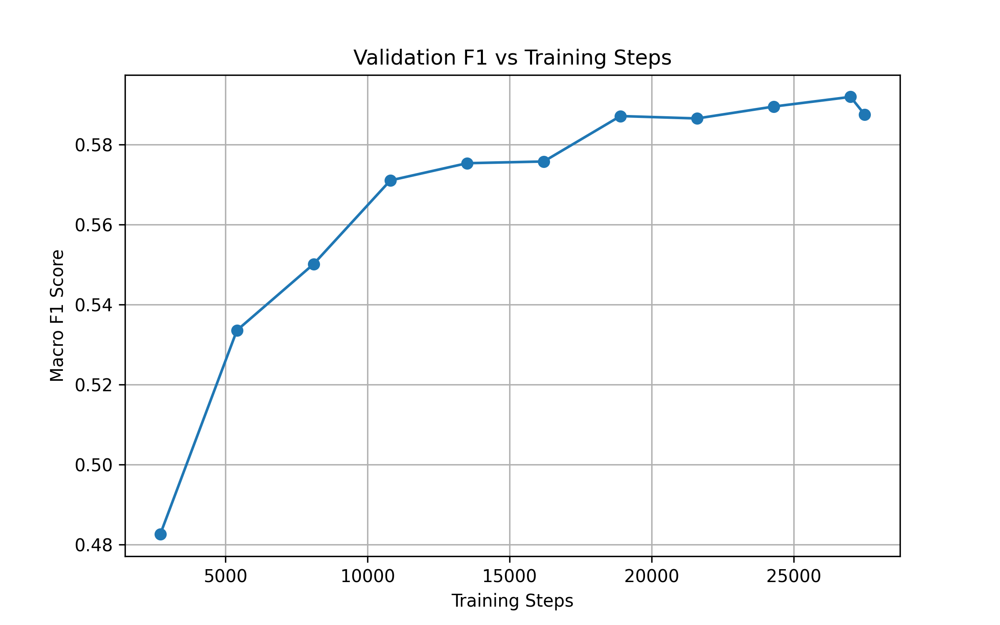
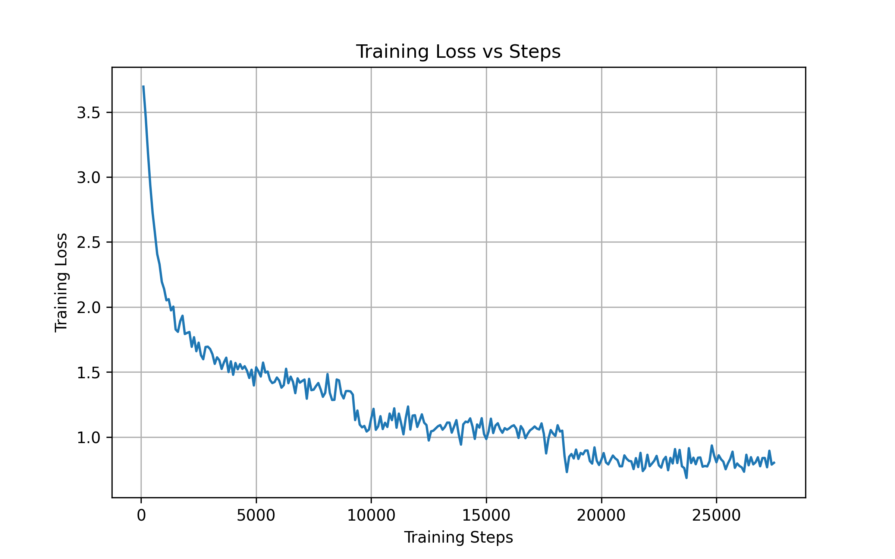
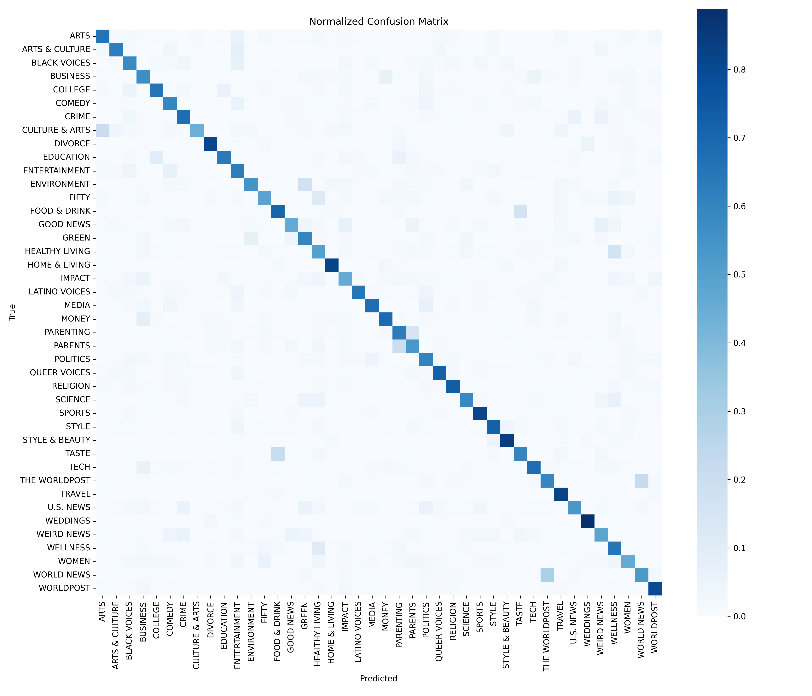

# 📰 News Category Classification with DistilBERT

This project fine-tunes a **DistilBERT** transformer model to perform **multi-class news article classification** on the **News Category Dataset** from Kaggle.  
The task involves predicting one of **42 news categories** based on article headlines and short descriptions.

---

## Dataset

- **Source:** [News Category Dataset – Kaggle](https://www.kaggle.com/datasets/rmisra/news-category-dataset)
- **Total samples:** ~209k
- **Classes:** 42
- **Input text:** `headline + short_description`
- **Label:** `category`

---

## Model

- **Base model:** `distilbert-base-uncased`
- **Framework:** PyTorch + Hugging Face Transformers
- **Task:** Multi-class sequence classification
- **Loss:** Class-weighted CrossEntropyLoss (to handle imbalance)

---

## Training Setup

- **Train / Val / Test split:** 70% / 15% / 15%
- **Batch size:** 16
- **Learning rate:** 2e-5
- **Epochs:** 3
- **Evaluation strategy:** Step-based (every 2700 steps)
- **Metric for best model:** Macro F1
- **Mixed precision:** FP16 (GPU)

The best model checkpoint is automatically selected using validation **macro F1**.

---

## Results (Test Set)

| Metric          | Value     |
| --------------- | --------- |
| Accuracy        | **64.9%** |
| Macro Precision | **0.56**  |
| Macro Recall    | **0.64**  |
| **Macro F1**    | **0.59**  |
| Weighted F1     | **0.66**  |

This is a strong result for a **42-class** dataset with significant semantic overlap.

---

## Visualizations

### Category Distribution

Shows strong class imbalance in the dataset.

---

### Validation F1 vs Training Steps

Demonstrates stable learning and convergence.

---

### Training Loss vs Steps

Confirms consistent optimization during fine-tuning.

---

### Normalized Confusion Matrix

Highlights where categories are most frequently confused.

---

## Observations

- **Strong performance** on clearly defined categories like:
  - TRAVEL, STYLE & BEAUTY, SPORTS, WEDDINGS, POLITICS
- **Lower performance** on abstract or overlapping labels:
  - U.S. NEWS, GOOD NEWS, FIFTY, WOMEN
- Errors are largely due to **label ambiguity**, not model failure.

---

## Future Improvements

- Try **RoBERTa-base** for higher performance
- Merge overlapping categories
- Perform detailed error analysis
- Deploy using FastAPI

---

## Conclusion

This project demonstrates an **end-to-end NLP pipeline** using transformers, including:

- Data preprocessing
- Handling class imbalance
- Fine-tuning a pre-trained model
- Evaluation with strong metrics and visual analysis
